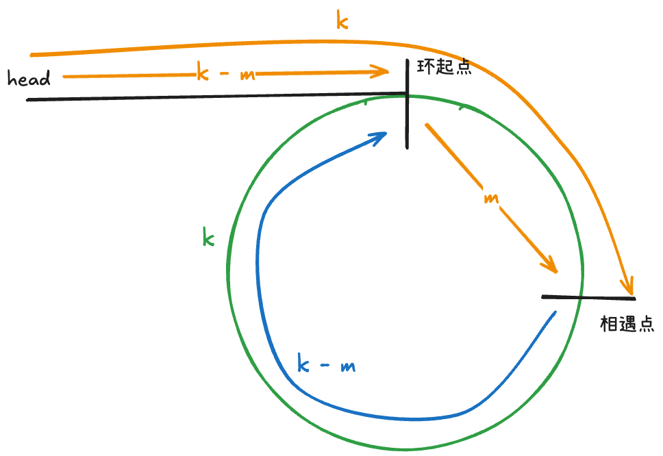

使用两个快慢指针 slow 和 fast，每次 slow 走一步，fast 走两步

当快慢指针相遇时，假设 slow 走了 `k` 步，那么 fast 一定走了 `2k` 步，这多走的 `k` 步其实就是 `fast` 指针在环里转圈圈，所以 `k` 的值就是环长度的「整数倍」。

假设相遇点距环的起点的距离为 m，那么环的起点距头结点 head 的距离为 k - m，也就是说如果从 head 前进 k - m 步就能到达环起点。

巧的是，如果从相遇点继续前进 k - m 步，也恰好到达环起点。因为从相遇点开始走k步可以转回到相遇点，那走 k - m 步肯定就走到环起点了

因此当快慢指针相遇时，我们让其中任一个指针指向头节点，然后让它俩以相同速度前进，再次相遇时所在的节点位置就是环开始的位置

