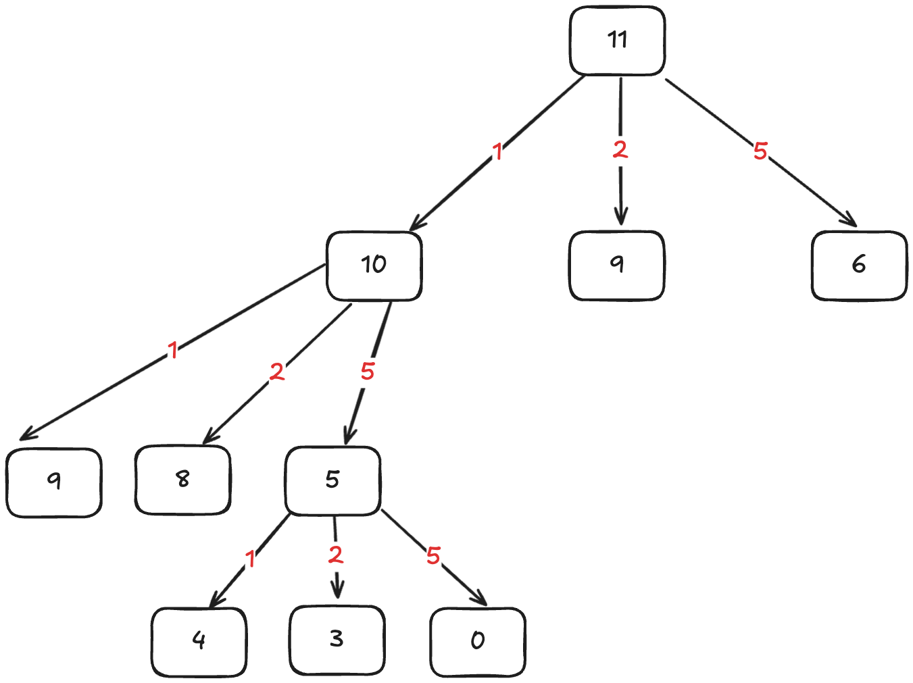

首先，这个问题是动态规划问题，因为它具有「最优子结构」的。 **要符合「最优子结构」，子问题间必须互相独立** 。啥叫相互独立？

比如说，假设你考试，每门科目的成绩都是互相独立的。你的原问题是考出最高的总成绩，那么你的子问题就是要把语文考到最高，数学考到最高…… 为了每门课考到最高，你要把每门课相应的选择题分数拿到最高，填空题分数拿到最高…… 当然，最终就是你每门课都是满分，这就是最高的总成绩。

得到了正确的结果：最高的总成绩就是总分。因为这个过程符合最优子结构，「每门科目考到最高」这些子问题是互相独立，互不干扰的。

但是，如果加一个条件：你的语文成绩和数学成绩会互相制约，不能同时达到满分，数学分数高，语文分数就会降低，反之亦然。

这样的话，显然你能考到的最高总成绩就达不到总分了，按刚才那个思路就会得到错误的结果。因为「每门科目考到最高」的子问题并不独立，语文数学成绩户互相影响，无法同时最优，所以最优子结构被破坏。

回到凑零钱问题，为什么说它符合最优子结构呢？假设你有面值为 `1, 2, 5` 的硬币，你想求 `amount = 11` 时的最少硬币数（原问题），如果你知道凑出 `amount = 10, 9, 6` 的最少硬币数（子问题），你只需要把子问题的答案加一（再选一枚面值为 `1, 2, 5` 的硬币），求个最小值，就是原问题的答案。因为硬币的数量是没有限制的，所以子问题之间没有相互制，是互相独立的。

既然知道了这是个动态规划问题，就要思考如何列出正确的状态转移方程

1. **确定「状态」，也就是原问题和子问题中会变化的变量**。由于硬币数量无限，硬币的面额也是题目给定的，只有目标金额会不断地向 base case 靠近，所以唯一的「状态」就是目标金额 amount。
2. **确定「选择」，也就是导致「状态」产生变化的行为** 。目标金额为什么变化呢，因为你在选择硬币，你每选择一枚硬币，就相当于减少了目标金额。所以说所有硬币的面值，就是你的「选择」。
3. **明确 `dp` 函数/数组的定义** 。我们这里讲的是自顶向下的解法，所以会有一个递归的 `dp` 函数，一般来说函数的参数就是状态转移中会变化的量，也就是上面说到的「状态」；函数的返回值就是题目要求我们计算的量。就本题来说，状态只有一个，即「目标金额」，题目要求我们计算凑出目标金额所需的最少硬币数量

**所以我们可以这样定义 `dp` 函数：`dp(n)` 表示，输入一个目标金额 `n`，返回凑出目标金额 `n` 所需的最少硬币数量** 。

$$
dp(n) = \begin{cases}
0,n = 0
 \\ -1, n < 0
 \\ min\left \{ dp(n-coin) + 1 \mid coin \in coins, n > 0 \right \}
\end{cases}
$$
