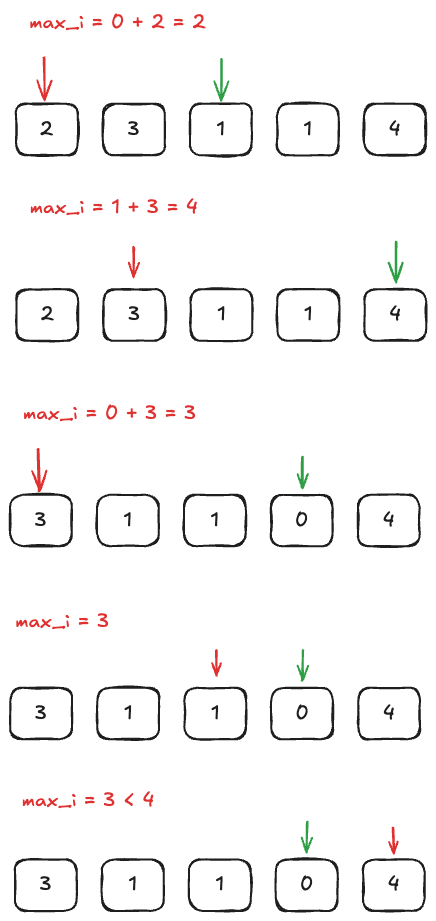

这是一道贪心算法的题目，贪心算法是一种在每一步选择中都采取当前状态下最优（局部最优）的选择，从而希望导致全局最优解的算法策略。贪心算法的核心思想是“贪心选择”，即通过局部最优解逐步构建全局最优解。

1. 贪心算法的特点

   - 局部最优选择：在每一步决策中，选择当前看起来最优的解决方案
   - 无后效性：当前的选择不会影响后续的选择，即不会回退或重新选择
   - 不保证全局最优：贪心算法不一定能得到全局最优解，但在某些问题中可以得到最优解

2. 贪心算法的适用场景
   贪心算法适用于满足以下条件的问题：

   - 最优子结构：问题的最优解包含子问题的最优解
   - 贪心选择性质：通过局部最优选择能够达到全局最优解

3. 常见的使用贪心算法的问题包括：

   - 活动选择问题（选择最多的互不冲突的活动）
   - 霍夫曼编码（构建最优前缀编码）
   - 最小生成树问题（如 Kruskal 算法和 Prim 算法）
   - 最短路径问题（如 Dijkstra 算法）
   - 分数背包问题（物品可以分割）

这道题其实不用想太多，直接开始跳就行，我们跳的时候尽可能就去到达最远的位置

