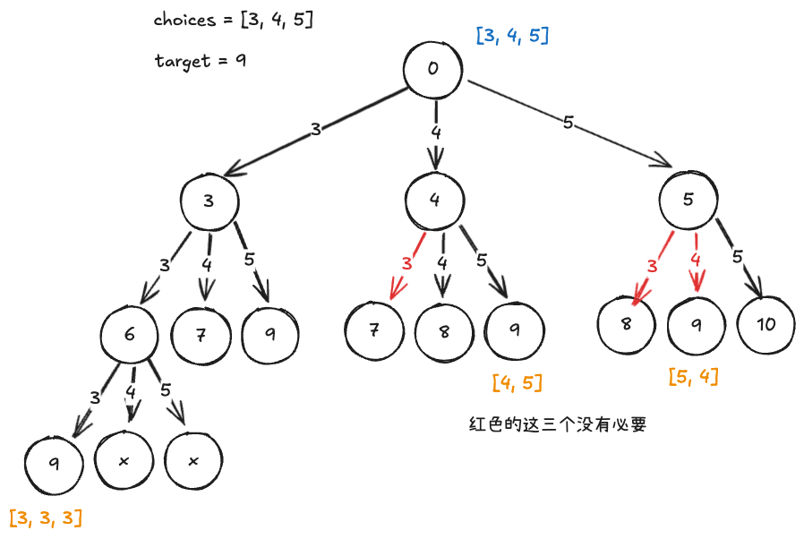

这个题和[46.全排列](../46.全排列/)很像，也是一个回溯问题，可以直接用回溯的框架写出代码来

```python
class Solution:
    def __init__(self):
        self.res = []

    def combinationSum(self, candidates: List[int], target: int) -> List[List[int]]:
        self.backtrack(candidates, target)
        return self.res

    def backtrack(self, candidates: List[int], target: int, track: List[int] = None):
        if track == None:
            track = []
        if target == 0:
            self.res.append(track.copy())
            return
        if target < 0:
            return
        for candi in candidates:
            track.append(candi)
            self.backtrack(candidates, target - candi, track)
            track.remove(candi)
```

虽然可以成功找出所有子集，但是会存在重复的子集，我们画出回溯树来看，可以发现重复子集是在以不同顺序选择数组元素时产生的

1. 第一轮和第二轮分别选择 3 , 4 ，会生成包含这两个元素的所有子集，
2. 若第一轮选择 4 ，则第二轮应该跳过 3
3. 若第一轮选择 5，则第二轮应该跳过 3, 4，因为子集 [5,3,⋯] 和子集 [5,4,⋯] 和 前面生成的子集完全重复



总结来说，从第二个分支开始，都不考虑前面分支已经使用的元素了

还有一个优化是在开启搜索前，先将数组 nums 排序。在遍历所有选择时，当子集和超过 target 时直接结束循环，因为后边的元素更大，其子集和都一定会超过 target
