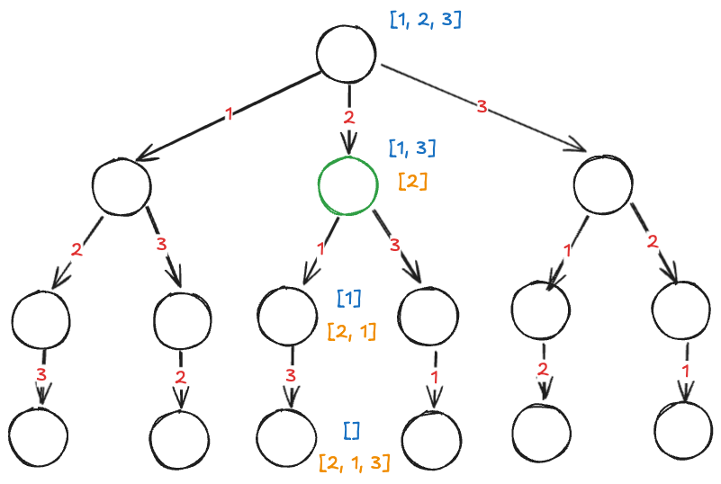

抽象地说，解决一个回溯问题，实际上就是遍历一棵决策树的过程，树的每个叶子节点存放着一个合法答案。你把整棵树遍历一遍，把叶子节点上的答案都收集起来，就能得到所有的合法答案。

站在回溯树的一个节点上，你只需要思考 3 个问题：

1、路径：也就是已经做出的选择。

2、选择列表：也就是你当前可以做的选择。

3、结束条件：也就是到达决策树底层，无法再做选择的条件。

代码方面，回溯算法的框架：

```python
result = []
def backtrack(路径, 选择列表):
    if 满足结束条件:
        result.add(路径)
        return
  
    for 选择 in 选择列表:
        做选择
        backtrack(路径, 选择列表)
        撤销选择
```

**其核心就是 for 循环里面的递归，在递归调用之前「做选择」，在递归调用之后「撤销选择」**

我们在高中的时候就做过排列组合的数学题， `n` 个不重复的数，全排列共有 `n!` 个，我们是怎么穷举出这个结果的了

比方说给三个数 `[1, 2, 3]`，一般是这样：

先固定第一位为 1，然后第二位可以是 2，那么第三位只能是 3；然后可以把第二位变成 3，第三位就只能是 2 了；然后就只能变化第一位，变成 2，然后再穷举后两位……

其实这就是回溯算法，我们可以直接画出这棵回溯树


只要从根遍历这棵树，记录路径上的数字，其实就是所有的全排列，**我们不妨把这棵树称为回溯算法的「决策树」，为啥说这是决策树呢，因为你在每个节点上其实都在做决策。**

假设你在上图中顶点下面那个节点上，你现在就在做决策，可以选择 1 那条树枝，也可以选择 3 那条树枝。为啥只能在 1 和 3 之中选择呢？因为 2 这个树枝在你身后，这个选择你之前做过了，而全排列是不允许重复使用数字的

**这里 `[2]` 就是「路径」，记录你已经做过的选择；`[1,3]` 就是「选择列表」，表示你当前可以做出的选择；「结束条件」就是遍历到树的底层叶子节点，这里也就是选择列表为空的时候** 。

**我们定义的 `backtrack` 函数其实就像一个指针，在这棵树上游走，同时要正确维护每个节点的属性，每当走到树的底层叶子节点，其「路径」就是一个全排列** 。

再进一步，如何遍历一棵树？这个应该不难吧

```python
def traverse(root: TreeNode):
    for child in root.children:
        # 前序位置需要的操作
        traverse(child)
        # 后序位置需要的操作
```

而所谓的前序遍历和后序遍历，他们是两个很有用的时间点，**前序遍历的代码在进入某一个节点之前的那个时间点执行，后序遍历代码在离开某个节点之后的那个时间点执行**

回想我们刚才说的，「路径」和「选择」是每个节点的属性，函数在树上游走要正确处理节点的属性，那么就要在这两个特殊时间点搞点动作
