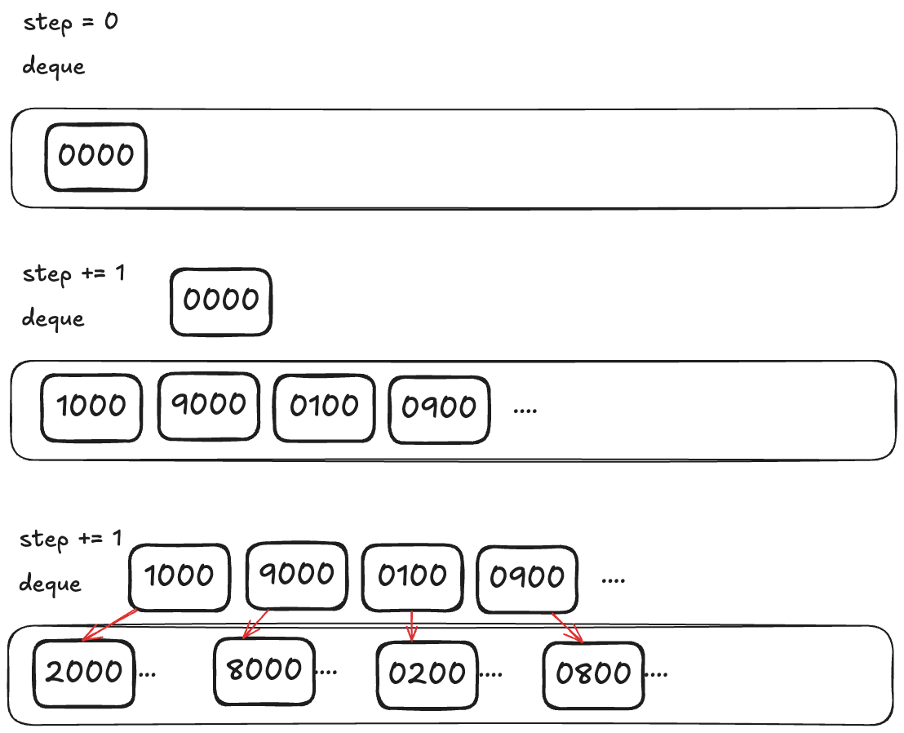

一般来说看到这种最短路径问题，首先应该想到是不是BFS，BFS 算法的本质就是遍历一幅图，而图的遍历算法其实就是多叉树的遍历算法加了个 `visited` 数组防止死循环；多叉树的遍历算法又是从二叉树遍历算法衍生出来的，BFS 算法的本质就是二叉树的层序遍历。

其实所谓的最短路径，都可以类比成二叉树最小深度这类问题（寻找距离根节点最近的叶子节点），递归遍历必须要遍历整棵树的所有节点才能找到目标节点，而层序遍历不需要遍历所有节点就能搞定，所以层序遍历适合解决这类最短路径问题

