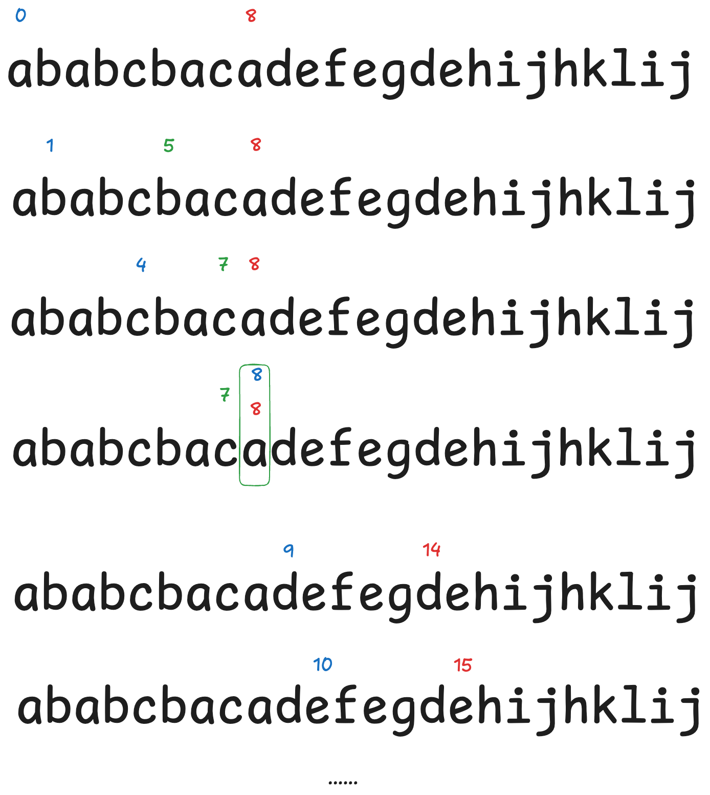

这是一道贪心算法的问题。

1. 首先看第一个字母，找到它在串里面最后出现的位置，记为 `last`
2. 然后在 `0~last`中挨个查其他字母在串中最后出现的位置，是不是比 `last`大，是的话说明这一段的分割位置还要向后移动，所以我们把这个更大的位置更新为 `last`，不是的话就无视
3. 肯定有一个时间，`last`无法再更新了，也就是遍历到了 `last`这个位置，那么这个时候这个位置就是我们的分隔位置，题目要分隔后的长度，那就是 `last - startIndex + 1`
4. 找到一个分割位，更新一下起始位置，重置 `last`，继续搜索就行了

