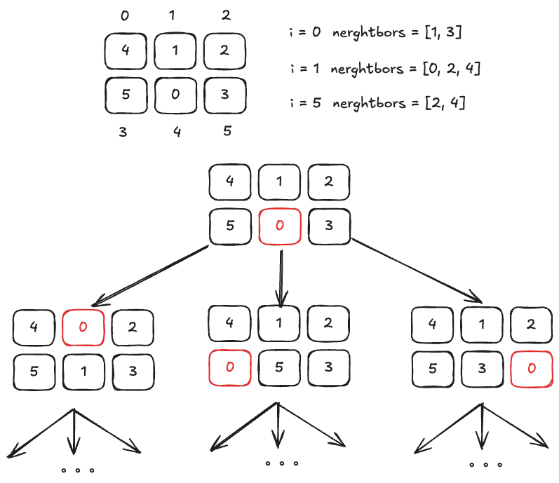

这个题和[752](../752.打开转盘锁/)打开转盘锁一样是一个 BFS 的问题，这题的一个难点在于如何找到邻居节点

假设棋盘的初始位置是[[4,1,2], [5,0,3]，我们的目标是把棋盘变成[[1,2,3],[4,5,0]]

其实把数字 0 和上下左右的数字进行交换，就是起点的 4 个邻居节点，这里因为是 2x3 的棋盘，因此邻居节点最多只会有 3 个

以此类推，这些邻居节点还有各自的邻居节点，最后构成了一幅图，我们从起点开始使用 BFS 算法遍历这幅图，第一次到达终点时，走过的步数就是答案

